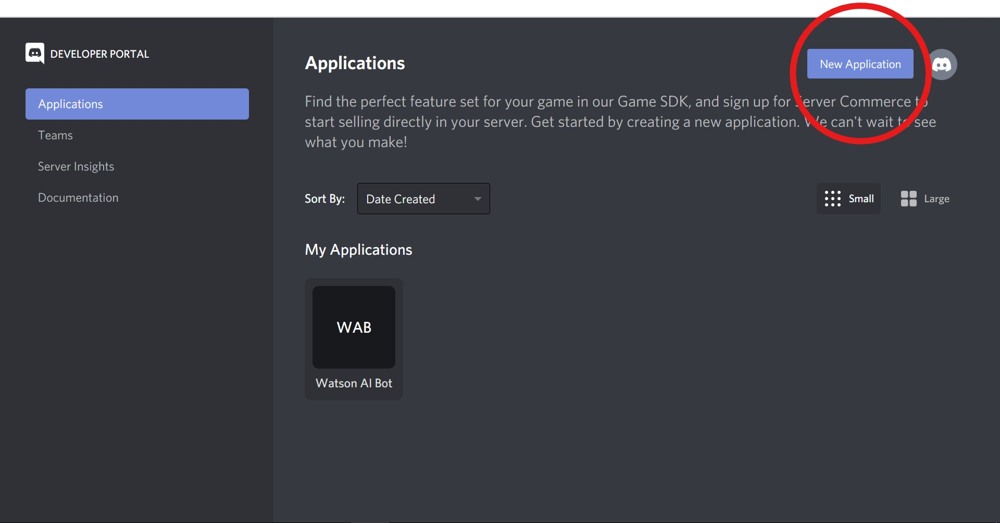
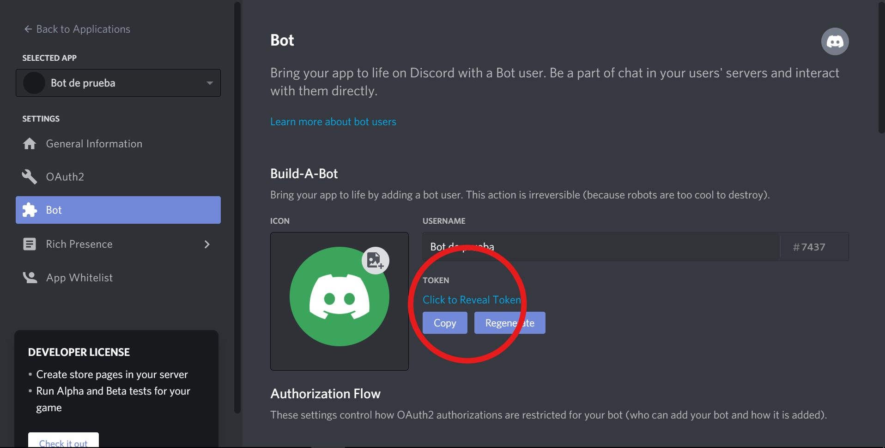
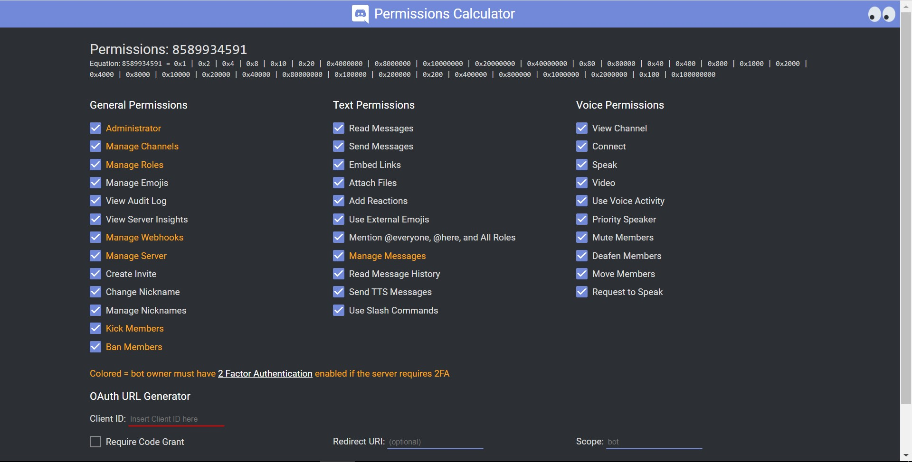
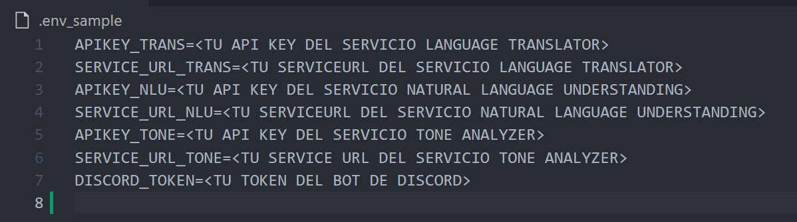
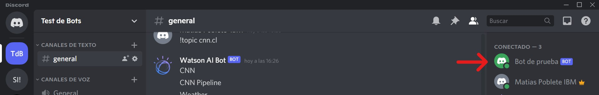
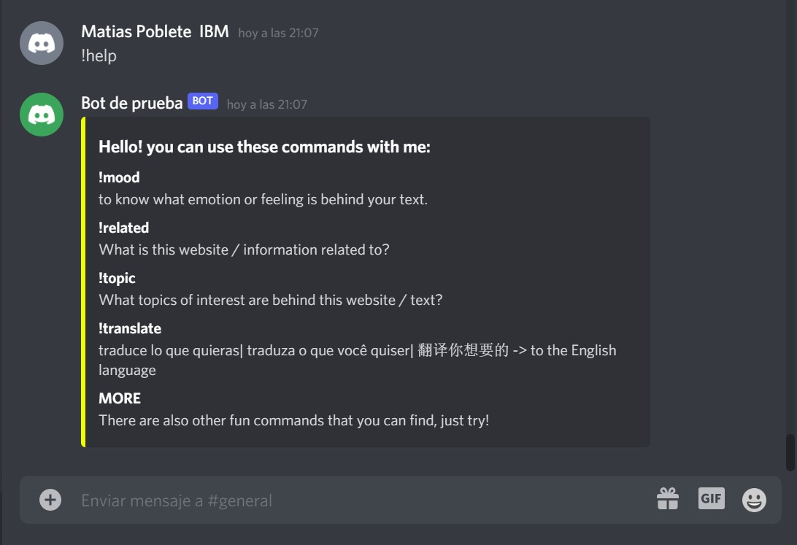
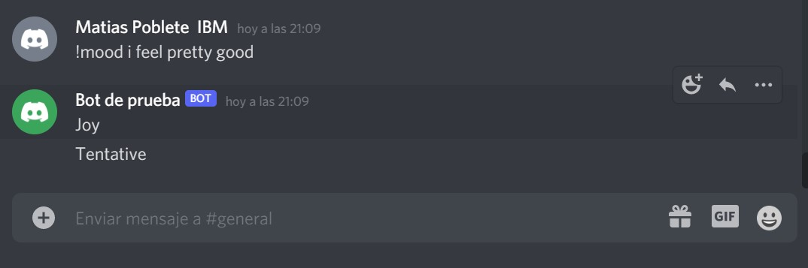
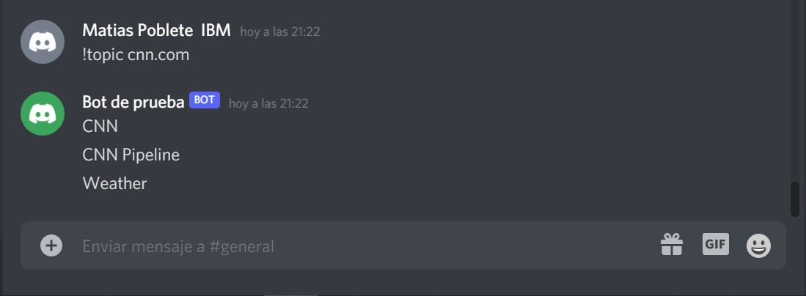
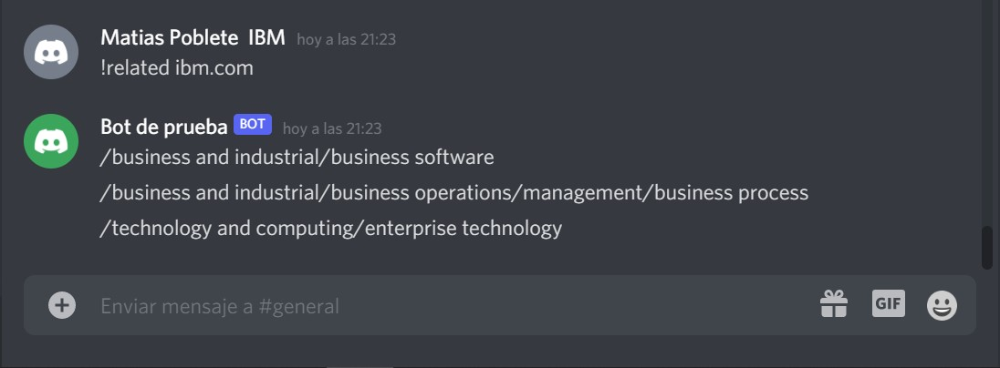

# Dale vida a un chatbot en Discord usando APIs de Watson AI
[](https://nodei.co/npm/discord.js/)


## Resumen
En este Code Pattern extenderás las capacidades de un bot de Discord dotándole de inteligencia artificial con diferentes recursos de Watson para, entre otras cosas, poder traducir texto, identificar el tono o incluso establecer un diálogo inteligente según lo configurado en el asistente virtual implementado con Watson Assistant.

Todos estos servicios de Watson los puedes desplegar de manera gratuita en en IBM Cloud.

También haremos que el bot está siempre activo desplegándolo en un cluster de Kubernetes. Lo integraremos con la plataforma de mensajería y llamadas de Discord, colocándolo en un servidor para clientes y colegas, todo esto mediante la programación sencilla en Node.js. 

## Tecnologias

- [Discord.js](https://discord.js.org/#/docs/main/stable/general/welcome)
- [Node.js](https://nodejs.org/en/docs/guides/getting-started-guide/)
- [Natural Language Understanding](https://cloud.ibm.com/docs/natural-language-understanding)
- [Language Translator](https://cloud.ibm.com/docs/language-translator)
- [Tone Analyzer](https://cloud.ibm.com/docs/tone-analyzer)
- [Watson Assistant](https://cloud.ibm.com/docs/assistant?topic=assistant-getting-started)
- [Kubernetes](https://cloud.ibm.com/docs/containers?topic=containers-getting-started)

Tiempo estimado: 30 a 45 minutos.

### Prerequisitos
- Contar con una cuenta de [IBM Cloud](https://cloud.ibm.com/), el plan Lite sirve para este Code Pattern.
- Contar con una cuenta registrada en la plataforma de [Discord](https://discord.com/), se recomienda tener el programa o la aplicación instalada para más rapida ejecución y debug.
- Contar con [Node.js](https://nodejs.org/en/download/) instalado en tu máquina, ya sea Linux, Windows o Mac.
- Contar con [Docker](https://www.docker.com/get-started) instalado en tu maquina, puedes usar también el software de Docker Desktop si es que no tienes muchas experiencia con Docker, aunque para este tutorial no será necesario saber mucho sobre esta tecnología.
- Contar con recursos creados de Natural Language Understanding, Language Translator y Tone Analyzer (técnicamente puedes usar el servicio de Watson que quieras mientras puedas acceder a su API, aunque deberas cambiar el codigo fuente original si es que pruebas otra, los servicios elegidos son a forma de muestra). Si tienes alguna duda de como crear estos servicios visita los enlaces de las tecnologias que están arriba.
- Tener desplegado un skill en [Watson Assistant](https://cloud.ibm.com/docs/containers?topic=containers-getting-started) con las intenciones, los diálogos y las entidades configuradas. 
- Disponer de un cluster de Kubernetes desplegado (la cuenta trial a la que te acceso esta página de registro [Registro IBM Cloud](https://ibm.biz/BdfhcR) te permite crear un cluster de manera gratuita y tenerlo disponible durante 30 días)

## Descripción

El usuario de Discord podrá invitar al bot a un servidor y mediante comandos podrá usar los diferentes recursos inteligentes, como se acostumbra a tratar con los bots de la plataforma. 

El bot es programado mediante un programa sencillo en Node.js el cual permite ingresar usando permisos mediante el token del bot de Discord, además, el programa realizará llamadas a las APIs de los servicios Watson que nosotros queramos, en este caso, este Code Pattern utilizará varias llamadas a los 3 servicios mencionados previamente: Language Translator, NLU y Tone Analyzer, permitiendo así poder usar el bot como traductor al inglés desde el español, portugués y chino, análisis de emociones extraídos de un texto y la extracción de conocimiento de websites.

El bot también interactua mediante llamadas al API con el servicio de Watson Assistant desplegado en IBM Cloud que previamnente habremos configurado.

Para que nuestro bot tenga vida permanente, utilizaremos Docker para generar la imagen que luego usaremos para desplegar el pod en nuestro cluster de Kubernetes.

## Flow

<p align="center">
  </img>
</p>

-	El usuario interactúa con el bot en la plataforma Discord.
-	El bot utiliza la aplicación Node.js para recibir los comandos.
- La aplicación se conteineriza y despliega como un pod en un cluster de Kubernetes
-	Dentro de la app Node.js se realizan las llamadas a la APIs de los servicios de Watson
-	Las respuestas de las APIs son recibidas y acomodadas por la app.
-	El bot entrega las respuestas al usuario en Discord.


## Instrucciones y Pasos

### 1. Registra un nuevo Bot en Discord Developers.

Para crear nuestro bot primero debemos registrar un nuevo bot en el sitio de Discord developers, esto permitirá generar un bot con nombre, descripción e imagen que represente lo que queremos crear, además de darle una entidad dentro de los servidores de Discord, para esto:

Primero, debes dirigirte a [Discord Developer Portal](https://discord.com/developers/applications) e iniciar sesión en el sitio, dentro de este deberías ver una opción para "New Application", haz clic en él como se aprecia en la imagen de abajo recalcado en el círculo rojo.

<p align="center">
  </img>
</p>

Dale el nombre que quieras y haz clic en "Create".

<p align="center">
  </img>
</p>

Ahora deberías estar dentro de los settings de tu aplicación, en nuestro caso, el uso de esta aplicación será el marco de nuestro bot, por lo tanto, podemos dar una descripción de lo que hará nuestro bot dentro de la descripción de la aplicación, luego para continuar, haz clic dentro de la opción "Bot".

<p align="center">
  </img>
</p>

Haz click en "Add Bot".

<p align="center">
  </img>
</p>

Ahora ya cuentas con un bot registrado, dale el nombre que quieras (puede ser el mismo nombre que el de la aplicación, la verdad no hay mucha diferencia), coloca el icono que quieras y guarda los cambios. Para pasos posteriores, es **importante que guardes tu token personal del bot**, este token es el que va a permitir controlar y manejar tu bot, es confidencial solo para ti.

<p align="center">
  </img>
</p>

------------------------------------------------------------------------------------------------------------

### 2. Añade el Bot a un servidor.

Aún nuestro bot no hace nada, pero pronto lo hará, por ahora ya que tenemos registrado el bot podemos añadirlo a un servidor para comenzar a darle características, puedes agregarlo al servidor que tú quieras. Recuerda que deberás crear un servidor usando el interface de Discord. 
Una vez creado dicho servidor podrás agregar el bot, para ello, debemos hacer lo siguiente:

Visita la [Calculadora de Permisos de Discord](https://discordapi.com/permissions.html), dentro de ellas seleccionaremos todos los permisos, no te preocupes por temas de seguridad y privacidad, nuestro bot solo realizará respuestas a consultas, no tendrá facultades para realizar más acciones que solo responder a textos (aunque él lo quiera).

<p align="center">
  </img>
</p>

Luego, vuelve al sitio de los settings de tu aplicación en el Discord Developer Portal, dirígete a "General Information" y copia tu "APPLICATION ID"

<p align="center">
  </img>
</p>

Ahora pega este ID dentro de la Calculadora de Permisos de Discord.

<p align="center">
  </img>
</p>

Hecho esto, ya tienes listo tu enlace propio (y enlace para compartir) para permitir que tu bot entre a tu servidor y al que tú quieras, ingresa al enlace, selecciona el servidor que quieras, y dale a "Continuar"

<p align="center">
  </img>
</p>

A continuación, acepta los permisos otorgados al bot haciendo clic en "Autorizar" (Recuerda que el bot solo puede responder comandos que ya están programados, y esto solo contempla llamadas a APIs, por lo tanto, no puede comprometer la privacidad ni seguridad de ningún servidor)

<p align="center">
  </img>
</p>

Si hiciste todo lo anterior, felicidades, ¡ya tienes tu bot (vacío aún) dentro de tu servidor!

<p align="center">
  </img>
</p>

Puedes revisar este video que recopila todo el proceso: [Code Your Own Discord Bot](https://www.youtube.com/watch?v=j_sD9udZnCk) créditos al canal de Codelyon en Youtube.

------------------------------------------------------------------------------------------------------------

### 3. Configura el bot con Node.js

Ahora vamos a configurar nuestro bot para que funcione como un chatbot inteligente, para esto debes hacer lo siguiente:

Clona este repositorio en una consola de comandos o bash:

```
git clone https://github.com/luisreyesoliva/watson-discord.git
```
Entra en la carpeta del proyecto:

```
cd watson-discord 
```
Ya dentro de esta carpeta encontramos todo lo necesario para dar vida al bot, tenemos el archivo "main.js" desde el cual se orquesta las funciones del bot, todo escrito en Node.js, tenemos también la carpeta "commands" en los cuales encontramos los comandos base e iniciales como "ping.js" y los de Watson como "lang_translator.js", "nlu_analyzer_cat.js", "nlu_analyzer_con.js", "tone_analyzer.js" y "watson_assistant.js".

Además hemos preparado el Dockerfile que permitirá construir una imagen con todo lo necesario para ejecutar nuestro bot, ¡Sin tener que programar nada!

Las funciones inteligentes (traducción, NLU, etc.) ya están entrenadas en IBM Cloud, solo debes darle acceso a ellas a través de los servicios que ya tienes creados como se detallan en los **Prerequisitos** de este code pattern.

Para conectar con estos servicios tendrás que especificar las credenciales correspondientes y los endpoints de cada servicio. Para ello:
1. Abre y modifica el archivo ".env_sample" el cual es un template de todos los accesos que necesita el bot.
2. Copia todas las API Keys y Service Url de tus recursos de Watson y pegalos
3. En el caso de Watson Assistant, recuerda debes tener creado y configurado un asistente previamente, con sus intenciones, entidades y diálogos. Para configurar las conexiones al servicio selecciona el asistente adecuado y elige la opción settings del menú desplegable, donde tendrás acceso a: 
- API Key
- Assistant URL
- Assistant ID
4. Por último, tendrás que copiar y pegar el token de tu bot que se muestra en el paso **1. Registra un nuevo Bot en Discord Developers**, si te queda alguna duda de cómo conseguir estos accesos, ingresa a la documentación en **Tecnologías**.

<p align="center">
  </img>
</p>

A continuación, renombra el archivo anterior a solo ".env".

Teniendo todo lo anterior listo, podemos proceder a construir la imagen completa de los recursos de nuestro bot con Docker, como ves, no hay nada de programación hasta ahora, y tampoco habrá, ya que los comandos ya están programados anteriormente, de los cuales te contaré más después de ejecutar el bot.

Para construir la imagen del bot, en la raíz del proyecto clonado ejecutaremos lo siguiente.
Tagea el nombre de la imagen con el formato 'repositorio/imagen:versión' donde 'repositorio' es un repositorio válido de Dockerhub donde subiremos la imagen:

```
docker build -t <NOMBRE-IMAGEN-BOT> .
```

Esperamos su construcción, y lo subimos al Dockerhub. 
Si no tienes cuenta en Docker, ahora es buen momento para crearala. Accede a https://hub.docker.com/para registrarte y crear un repositorio donde almacenar tus imágenes. 

```
docker push <NOMBRE-IMAGEN-BOT>
```
Ya tenemos nuestra imagen creada con todo lo que necesita el bot para ejecutarse. Ahora lo probaremos antes de desplegarlo en Kubernetes.

### 4. Testeando el bot

Prueba a ejecutar el contenedor en tu localhost para testear que todo está correcto.

```
docker run <NOMBRE-IMAGEN-BOT>
```
Si todo salió bien, deberías ver que tu bot se encuentra en línea, viendo esto en tu consola o bash:

```
Watson AI Bot is online!
```

Si ves algo distinto a esto, procura revisar si los accesos copiados al archivo ".env" son los correctos para tus servicios de Watson.

Ahora, con nuestro bot en línea, deberíamos ver al bot en estado de conectado en el servidor de Discord, como se ve en esta imagen.

<p align="center">
  </img>
</p>

Llegando a esta parte, el bot se encuentra completamente listo para ser usado, prueba escribiéndole el comando "!help" comenzado con el prejifo "!".

<p align="center">
  </img>
</p>

¡Prueba a utilizar alguno de esos comandos! 
- El comando **!mood** permite conocer alguna emoción o sentimiento encontrado en una oración o párrafo
- El comando **!related** te dará una buena idea sobre de que trata un texto de información o sitio web, sin tener que leerlo por completo
- El comando **!translate** permitirá traducir tu español, portugués o chino al inglés para así no toparse con la barrera del idioma
- El comando **!wa** te permitirá establecer un diálogo inteligente orquestado por Watson Assistant
- Existen otros comandos divertidos a probar, prueba con revisar la carpeta de "commands" del proyecto y en el programa "main.js" para encontrar los otros comandos... (pista: prueba con "gato" en inglés), en la carpeta "images" encontrarás el logo de Watson si es lo que deseas poner en tu bot.

Estas son algunas imagenes capturadas desde Discord, ¡Disfruta tu bot!

</img>
</img>
<p align="center"> </img> </p>

Realizadas las pruebas, procede a desactivar el bot. Pare ello tendrás que parar el contenedor que se está ejecutando en tu máquina.

Abre un terminal y ejecuta el comando Docker ps para ver la información del contenedor en ejecución.

```
docker ps
```
Copia el identificador y úsalo para parar el contendor con este comando:

```
docker stop <ID_CONTENEDOR>
```

Si ahora intentas interacturar con tu bot veras que ovbiamente se ha desconectado y no responderá a los comandos que envíes desde Discord. 

### 4. Desplegando la aplicación en Kubernetes

Ahora vamos a desplegar la aplicación en Kubernetes para que nuestro bot esté permanente activo en Discord y no se nos caiga, además podemos escalarlo en caso de que la demanda de interacciones crezca mucho. 

Para ello debemos contar previamente con un cluster de Kubernetes ya aprovisionado en IBM Cloud.

Primero configuraremos el acceso, para ello:

- Logate en [IBM Cloud](https://cloud.ibm.com) para acceder al Dasshboardo.
- Haz click en el icono de terminal (arriba a la derecha) para lanzar **IBM Cloud Shell**.

```text
ibmcloud ks clusters
```
- Configura la cli de `kubectl` para que acceda a tu cluster (indica el nombre de tu cluster).

```text
ibmcloud ks cluster config --cluster <tu cluster>
```

- Verifica que tienes accesso al API de Kubernetes.

```text
kubectl get namespace
```

Debería obtener todos los namespaces activos si todo ha ido bien.

```text
NAME              STATUS   AGE
default           Active   125m
ibm-cert-store    Active   121m
ibm-system        Active   124m
kube-node-lease   Active   125m
kube-public       Active   125m
kube-system       Active   125m
```

Ahora crearemos los recursos necesarios en K8s para que nuestra aplicación se ejecute y con ello arranque el bot en Discord. 

Para ello modifica el archivo "deployment.yaml" para indicar el mombre de la imagen que creaste en el paso anterior y que ya deberías tener subida al registro de Docker. 
Sustituye en el campo 'image' <NOMBRE-IMAGEN-BOT> por el nombre de la imagen que has creado.

```
image: <NOMBRE-IMAGEN-BOT>
```

Ya estamos casi! solo te queda crear el deployment y el servicio en K8s.

- Crea el deployment `watson-discord` 

```text
kubectl create -f deployment.yaml
```

- Y por último crea el servicio `watson-discord` para exponer nuestro pod hacia fuera del cluster.

```text
kubectl create -f service.yaml
```

Si todo salió bien, deberías ver que tu bot se encuentra de nuevo en estado de conectado en el servidor de Discord, como se ve en esta imagen.

<p align="center">
  </img>
</p>

Ahora nuesto bot se encuentra completamente listo para ser usado.

Prueba tus dialogos y disfruta de tu nuevo bot! 


## Conclusiones

Mediante este proyecto pudiste conocer tecnologías que ofrece Discord para los desarrolladores, Node.js para el back-end de una aplicación, un pequeño puñado de las capacidades inteligentes que se ofrecen en IBM Cloud/Watson y lo sencillo de construir una imagen de una aplicación a través de Docker, todo esto registrando, integrando y desplegando un bot en la plataforma de Discord, el cual, puedes personalizarlo y mejorarlo para mostrar a clientes y colaboradores.

------------------------------------------------------------------------------------------------------------

## Contenido Relacionado

- [Natural Language Understanding](https://cloud.ibm.com/docs/natural-language-understanding) y [API](https://cloud.ibm.com/apidocs/natural-language-understanding)
- [Language Translator](https://cloud.ibm.com/docs/language-translator) y [API](https://cloud.ibm.com/apidocs/language-translator)
- [Tone Analyzer](https://cloud.ibm.com/docs/tone-analyzer) y [API](https://cloud.ibm.com/apidocs/tone-analyzer)
- [Documentación de Desarrolladores de Discord](https://discord.com/developers/docs/intro)
- [Como usar una REST API](https://discordjs.guide/additional-info/rest-api.html#making-http-requests-with-node)
- [Docs de APIs de servicios de Watson](https://cloud.ibm.com/docs?tab=api-docs)
- [Proyecto en inglés: Chatbot para WhatsApp](https://developer.ibm.com/events/update-your-chatbot-on-whatsapp-with-ibm-watson-assistant/)
- [Servicio de Watson Assistant](https://developer.ibm.com/learningpaths/get-started-watson-assistant/)

## Licencia

Este Code Pattern se encuentra licenciado bajo Apache License, Version 2. Objetos de código de terceros invocados en dentro de este Code Pattern se encuentran licenciados bajo sus respectivos proveedores en conformidad con los términos de sus correspondientes licencias. Todas las contribuciones se encuentran sujetas al [Developer Certificate of Origin, Version 1.1](https://developercertificate.org/) y la [Apache License, Version 2](https://www.apache.org/licenses/LICENSE-2.0.txt).

[Preguntas frecuentes sobre Apache License](https://www.apache.org/foundation/license-faq.html#WhatDoesItMEAN)
